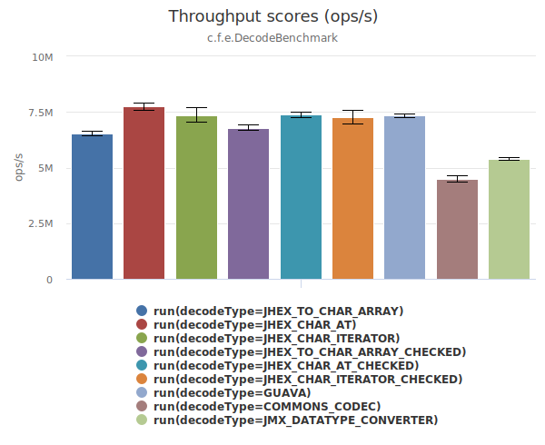

# jhex [](https://travis-ci.org/jamespedwards42/jhex) [  ](https://bintray.com/jamespedwards42/libs/jhex/_latestVersion) [](https://raw.githubusercontent.com/jhex/jedipus/master/LICENSE) [](https://codecov.io/gh/jamespedwards42/jhex)

[JHex](src/main/java/com/fabahaba/encode/JHex.java#L7) provides static utility methods for encoding to and decoding from hexadecimal encoded data.

```java
String hexString = "596f752772652077656c636f6d652e";
byte[] decoded = JHex.decode(hexString);
System.out.println(new String(decoded));
String reEncoded = JHex.encode(decoded);
// reEncoded.equals(hexString) == true ... promise.
```

###Benchmarks
######Environment
* Intel® Xeon(R) CPU E5-2687W v3 @ 3.10GHz × 20 / 128GB Memory / Ubuntu 16.04
* VM: JDK 9-ea+140 / options: -server -Xmx16G
* JMH 1.15, 1 thread, 5 warm-up & 10 measurement iterations.

Each benchmark method encodes or decodes an element from an array of 8388608 randomly generated elements.  The array is shuffled between each JMH iteration.

####[Decoding](src/jmh/java/com/fabahaba/encode/DecodeBenchmark.java#L79)

##### 8 byte elements

##### 32 byte elements

##### 128 byte elements

##### 512 byte elements

 
####[Encoding](src/jmh/java/com/fabahaba/encode/EncodeBenchmark.java#L66)

##### 8 byte elements 

##### 32 byte elements

##### 128 byte elements

##### 512 byte elements

